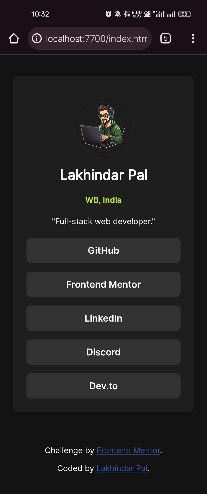

# Frontend Mentor - Social links profile solution

This is a solution to the [Social links profile challenge on Frontend Mentor](https://www.frontendmentor.io/challenges/social-links-profile-UG32l9m6dQ). Frontend Mentor challenges help you improve your coding skills by building realistic projects. 

## Table of contents

- [Overview](#overview)
  - [The challenge](#the-challenge)
  - [Screenshot](#screenshot)
  - [Links](#links)
- [My process](#my-process)
  - [Built with](#built-with)
  - [What I learned](#what-i-learned)
  - [Continued development](#continued-development)
  - [Useful resources](#useful-resources)
- [Author](#author)

## Overview

### The challenge

Users should be able to:

- See hover and focus states for all interactive elements on the page.

### Screenshot

### Links

- Solution URL: [https://github.com/LakhindarPal/social-links-profile](https://github.com/LakhindarPal/social-links-profile)
- Live Site URL: [https://lpal.netlify.app](https://lpal.netlify.app)

## My process

### Built with

- Semantic HTML5 markup
- CSS custom properties 
- Mobile-first workflow

### What I learned

In this project, I learned how to effectively use CSS custom properties to create a flexible and maintainable design system.Additionally, I gained experience in implementing hover and focus states for interactive elements, enhancing the user experience.

### Continued development

In future projects, I aim to further enhance my CSS skills, particularly in areas such as animations and transitions. 
### Useful resources

- [MDN Web Docs](https://developer.mozilla.org/en-US/docs/Web) - A comprehensive web development resource that I frequently refer to for learning and understanding web technologies.

## Author

- Frontend Mentor - [@LakhindarPal](https://www.frontendmentor.io/profile/LakhindarPal)
- Portfolio [@LakhindarPal](https://lakhindar.is-a.dev)
